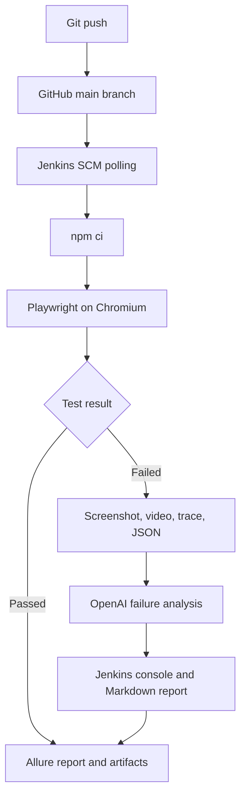

# AI QA Architect Lab

An end-to-end quality engineering lab that combines Playwright test automation, Jenkins CI, Docker, Allure reporting, failure artifacts, and OpenAI-powered root-cause analysis.

## What This Project Demonstrates

- Page Object Model test architecture with Playwright and TypeScript
- Reusable test-data layers for users and checkout customers
- Automated Chromium execution in a Dockerized Jenkins environment
- Source-change detection through Jenkins SCM polling
- Screenshots, videos, traces, and error context retained on failure
- Allure reports with test metadata and historical trends
- OpenAI-generated failure classification and recommended actions
- Secure API-key handling through Jenkins Credentials
- Cost control: OpenAI is called only when failures exist

## Pipeline Architecture



## Technology Stack

| Area | Technology |
|---|---|
| Test automation | Playwright, TypeScript |
| Test design | Page Object Model, reusable test data |
| CI orchestration | Jenkins Declarative Pipeline |
| CI runtime | Docker, Node.js |
| Reporting | Allure, Playwright HTML and JSON reporters |
| Failure evidence | Screenshots, videos, traces, error context |
| AI analysis | OpenAI Responses API |
| Source control | Git and GitHub |

## Automated Test Coverage

The current suite validates core SauceDemo e-commerce behavior, including:

- Successful authentication
- Locked-out user authentication behavior
- Complete purchase flow from login through order confirmation

The checkout test is marked in Allure as a critical smoke test and includes the epic, feature, story, severity, owner, and tag metadata.

## AI Failure-Analysis Workflow

When a test fails, Playwright writes machine-readable results to `test-results/results.json`. The analyzer extracts the failed test, location, status, error details, and retry evidence, then asks OpenAI to produce:

1. Failure summary
2. Expected and actual results
3. Likely root-cause category
4. Product-defect versus test-defect classification
5. Recommended next action

The resulting report is written to:

```text
ai-analysis/failure-analysis.md
```

Jenkins prints the report in Console Output and archives it with the other build evidence. Passing builds skip the OpenAI request.

## Failure Diagnostics

Failed attempts retain:

```text
test-results/
├── test-failed-1.png
├── video.webm
├── trace.zip
└── error-context.md
```

Open a downloaded trace locally with:

```powershell
npx playwright show-trace "$env:USERPROFILE\Downloads\trace.zip"
```

## Run Locally

Install dependencies and the Chromium browser:

```powershell
npm ci
npx playwright install chromium
```

Run the Chromium suite:

```powershell
npx playwright test --project=chromium
```

Open the Playwright HTML report:

```powershell
npx playwright show-report
```

## Jenkins Pipeline

The Jenkins pipeline performs the following work:

1. Checks out the latest `main` revision from GitHub.
2. Displays the Node.js and npm versions.
3. Installs locked dependencies with `npm ci`.
4. Installs the Playwright Chromium browser.
5. Runs the Playwright suite with one CI worker.
6. Runs the AI analyzer during post-processing.
7. Prints and archives the AI report.
8. Archives Playwright and Allure artifacts.
9. Publishes the Allure report and trend history.

SCM polling checks GitHub approximately every five minutes and starts a build only when it detects a new revision.

## Secure Configuration

The OpenAI key is stored as a Jenkins **Secret text** credential with this ID:

```text
openai-api-key
```

The Jenkinsfile binds it temporarily to `OPENAI_API_KEY` only while the analyzer runs. Never commit API keys, passwords, tokens, or other secrets to this repository.

## Project Structure

```text
ai-qa-architect-lab/
├── pages/                         # Playwright Page Objects
├── scripts/
│   └── ai-failure-analyzer.js     # OpenAI failure analyzer
├── test-data/                     # Reusable users and customer data
├── tests/                         # Playwright test specifications
├── Dockerfile.jenkins             # Jenkins runtime image
├── Jenkinsfile                    # CI pipeline definition
├── docker-compose.yml             # Local Jenkins services
├── package.json                   # Node.js dependencies
└── playwright.config.ts           # Playwright and reporter settings
```

## Interview Summary

> I designed an end-to-end AI-assisted QA pipeline using Playwright, TypeScript, Docker, Jenkins, GitHub, and Allure. A Git change triggers Jenkins through SCM polling. Jenkins installs locked dependencies, runs the Chromium regression suite, publishes Allure trends, and archives screenshots, videos, traces, and error context. Failed-test JSON is securely sent to the OpenAI API, which classifies the likely root cause and recommends the next action. The diagnosis appears directly in Jenkins and is preserved as a build artifact, while passing builds skip the API call to control cost.

## Current Status

- Playwright suite: passing
- Jenkins CI: operational
- SCM polling: operational
- Allure reporting and history: operational
- Failure evidence capture: verified
- OpenAI failure analysis: verified
- Secret masking: verified

